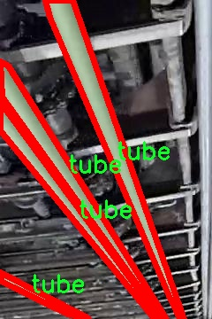

# 流水线管材图像分割系统： yolov8-seg-FocalModulation

### 1.研究背景与意义

[参考博客](https://gitee.com/YOLOv8_YOLOv11_Segmentation_Studio/projects)

[博客来源](https://kdocs.cn/l/cszuIiCKVNis)

研究背景与意义

随着工业自动化和智能制造的快速发展，图像处理技术在生产线上的应用愈发广泛。特别是在管材制造和检测领域，如何高效、准确地识别和分割管材图像，成为提升生产效率和产品质量的重要课题。传统的图像处理方法往往依赖于人工经验，难以适应复杂多变的生产环境，且处理速度较慢，无法满足实时监控和自动化生产的需求。因此，基于深度学习的图像分割技术逐渐成为研究的热点。

YOLO（You Only Look Once）系列模型因其高效的实时目标检测能力而受到广泛关注。YOLOv8作为该系列的最新版本，结合了更先进的网络结构和训练策略，能够在保证检测精度的同时，显著提高处理速度。然而，尽管YOLOv8在目标检测方面表现优异，但在特定应用场景下，尤其是管材图像的实例分割任务中，仍然存在一些挑战。针对这一问题，改进YOLOv8以适应流水线管材图像分割的需求，具有重要的研究意义。

本研究所使用的数据集“管材在口袋中”（Tubes in pocket）包含1200张图像，专注于单一类别的管材实例分割。这一数据集的构建为模型的训练和评估提供了丰富的样本基础。通过对该数据集的深入分析，我们可以提取出管材的特征信息，进而优化YOLOv8的网络结构和损失函数，使其在管材图像分割任务中表现更加出色。此外，数据集中仅包含一个类别的管材，使得模型在训练过程中能够集中学习该类别的特征，减少了类别间的干扰，从而提高了分割的准确性。

改进YOLOv8的流水线管材图像分割系统，不仅可以提升管材的检测和分割精度，还能够为后续的质量控制和缺陷检测提供可靠的数据支持。在实际应用中，该系统能够实时监控生产线上的管材状态，及时发现并处理潜在问题，从而降低生产成本，提高生产效率。此外，基于深度学习的图像分割技术，能够有效减少人工干预，降低人为错误的发生概率，进一步提升生产过程的自动化水平。

综上所述，基于改进YOLOv8的流水线管材图像分割系统的研究，不仅具有重要的理论价值，还具备广泛的实际应用前景。通过该研究，我们希望能够推动图像处理技术在管材制造领域的应用，为智能制造的发展贡献一份力量。同时，该研究的成果也将为其他工业领域的图像分割任务提供借鉴，促进相关技术的进一步发展与创新。

### 2.图片演示


注意：本项目提供完整的训练源码数据集和训练教程,由于此博客编辑较早,暂不提供权重文件（best.pt）,需要按照6.训练教程进行训练后实现上图效果。

### 3.视频演示

[3.1 视频演示](https://www.bilibili.com/video/BV1pFmRYEEnU/)

### 4.数据集信息

##### 4.1 数据集类别数＆类别名

nc: 1
names: ['tube']


##### 4.2 数据集信息简介

数据集信息展示

在计算机视觉领域，图像分割技术的不断进步为许多应用场景提供了强有力的支持，尤其是在工业自动化和质量检测方面。为了进一步提升YOLOv8-seg在流水线管材图像分割任务中的表现，我们构建了一个名为“Tubes in pocket”的数据集。该数据集专门针对管材的图像分割进行了精心设计，旨在为研究人员和工程师提供一个高质量的训练和测试平台。

“Tubes in pocket”数据集的核心目标是为流水线上的管材检测和分割提供丰富的图像样本。数据集中包含了多种场景下的管材图像，涵盖了不同的光照条件、背景复杂度以及管材的形状和尺寸变化。这种多样性确保了模型在实际应用中能够具备良好的泛化能力，从而提高其在真实环境中的应用效果。数据集的类别数量为1，具体类别为“tube”，这意味着所有的图像均围绕管材这一特定对象展开，确保了数据集的专一性和针对性。

在数据采集过程中，我们采用了多种拍摄角度和设备，以确保数据集的丰富性和多样性。每张图像都经过精确标注，确保管材的轮廓清晰可见，便于后续的分割算法进行学习和优化。标注过程中，我们使用了先进的图像标注工具，确保每个管材的边界都被准确捕捉，最大限度地减少了人为误差。这种高质量的标注不仅提升了数据集的可靠性，也为模型的训练提供了坚实的基础。

为了进一步增强数据集的实用性，我们还对图像进行了多种数据增强处理，包括旋转、缩放、翻转和亮度调整等。这些增强手段旨在模拟不同的拍摄条件和环境变化，使得模型在训练过程中能够接触到更多的变异情况，从而提升其鲁棒性。经过这些处理后，数据集的有效样本数量显著增加，为模型的训练提供了更加丰富的输入。

在训练YOLOv8-seg模型时，我们将“Tubes in pocket”数据集作为主要的训练和验证数据源。通过对该数据集的深入学习，模型能够逐步掌握管材的特征，学习到如何在复杂背景中准确识别和分割管材。这一过程不仅有助于提升模型的分割精度，也为后续的应用提供了强有力的支持。

总之，“Tubes in pocket”数据集为流水线管材图像分割系统的研究和开发提供了重要的基础。其专一的类别设置、丰富的图像样本以及高质量的标注，使得该数据集在训练YOLOv8-seg模型时具有极高的价值。未来，我们希望通过不断优化数据集的构建和标注流程，进一步提升模型的性能，为工业自动化领域的图像分割技术发展贡献力量。





### 5.项目依赖环境部署教程（零基础手把手教学）

[5.1 环境部署教程链接（零基础手把手教学）](https://www.bilibili.com/video/BV1jG4Ve4E9t/?vd_source=bc9aec86d164b67a7004b996143742dc)


[5.2 安装Python虚拟环境创建和依赖库安装视频教程链接（零基础手把手教学）](https://www.bilibili.com/video/BV1nA4VeYEze/?vd_source=bc9aec86d164b67a7004b996143742dc)

### 6.手把手YOLOV8-seg训练视频教程（零基础手把手教学）

[6.1 手把手YOLOV8-seg训练视频教程（零基础小白有手就能学会）](https://www.bilibili.com/video/BV1cA4VeYETe/?vd_source=bc9aec86d164b67a7004b996143742dc)


按照上面的训练视频教程链接加载项目提供的数据集，运行train.py即可开始训练



     Epoch   gpu_mem       box       obj       cls    labels  img_size
     1/200     0G   0.01576   0.01955  0.007536        22      1280: 100%|██████████| 849/849 [14:42<00:00,  1.04s/it]
               Class     Images     Labels          P          R     mAP@.5 mAP@.5:.95: 100%|██████████| 213/213 [01:14<00:00,  2.87it/s]
                 all       3395      17314      0.994      0.957      0.0957      0.0843

     Epoch   gpu_mem       box       obj       cls    labels  img_size
     2/200     0G   0.01578   0.01923  0.007006        22      1280: 100%|██████████| 849/849 [14:44<00:00,  1.04s/it]
               Class     Images     Labels          P          R     mAP@.5 mAP@.5:.95: 100%|██████████| 213/213 [01:12<00:00,  2.95it/s]
                 all       3395      17314      0.996      0.956      0.0957      0.0845

     Epoch   gpu_mem       box       obj       cls    labels  img_size
     3/200     0G   0.01561    0.0191  0.006895        27      1280: 100%|██████████| 849/849 [10:56<00:00,  1.29it/s]
               Class     Images     Labels          P          R     mAP@.5 mAP@.5:.95: 100%|███████   | 187/213 [00:52<00:00,  4.04it/s]
                 all       3395      17314      0.996      0.957      0.0957      0.0845


### 7.50+种全套YOLOV8-seg创新点加载调参实验视频教程（一键加载写好的改进模型的配置文件）

[7.1 50+种全套YOLOV8-seg创新点加载调参实验视频教程（一键加载写好的改进模型的配置文件）](https://www.bilibili.com/video/BV1Hw4VePEXv/?vd_source=bc9aec86d164b67a7004b996143742dc)

### YOLOV8-seg算法简介

原始YOLOv8-seg算法原理

YOLOv8-seg算法是目标检测领域中的一项重要进展，基于YOLOv8的架构，结合了目标检测与图像分割的能力，旨在实现更高效、更准确的物体识别和分割。该算法的设计理念源于YOLO系列的成功经验，特别是YOLOv5和YOLOv7的技术积累，同时引入了一系列创新的模块和策略，以适应复杂场景下的目标检测与分割任务。

首先，YOLOv8-seg算法的网络结构依然保持了YOLO系列一贯的设计框架，包括输入层、主干网络、特征融合层和解耦头（head）。在主干网络部分，YOLOv8-seg采用了CSPDarknet的思想，使用C2f模块替代了YOLOv5中的C3模块。C2f模块的设计充分考虑了轻量化与高效特征提取的平衡，通过引入ELAN（Efficient Layer Aggregation Network）思想，C2f模块不仅增强了特征流的传递，还通过多个分支结构提高了梯度流的丰富性。这种设计使得网络在深层次特征提取时，能够有效缓解梯度消失的问题，从而提升了模型的收敛速度和整体性能。

在特征融合层，YOLOv8-seg采用了PAN-FPN（Path Aggregation Network - Feature Pyramid Network）结构，这一结构能够有效地将不同层次的特征进行融合，确保网络在处理多尺度目标时的准确性。通过自下而上的融合方式，YOLOv8-seg能够充分利用浅层特征的细节信息与高层特征的语义信息，从而实现对目标的精准检测与分割。该结构在特征融合过程中，去除了YOLOv5中上采样阶段的1x1卷积，直接将高层特征进行上采样并与中层特征进行拼接，进一步提升了特征融合的效率。

YOLOv8-seg的一个显著特点是其采用了Anchor-Free的目标检测思想，这一创新使得模型在处理不同形状和大小的目标时，能够更加灵活。传统的Anchor-Based方法往往需要手动设计锚框，而YOLOv8-seg通过引入新的匹配策略，采用Task-Aligned的样本匹配方式，使得模型能够根据目标的实际特征进行自适应的匹配。这种方法不仅简化了模型的设计，还提高了检测的准确性。

在损失函数的设计上，YOLOv8-seg引入了VFLLoss和DFLLoss+CIoULoss的组合，这一组合能够有效地处理分类和回归任务中的不平衡问题，尤其是在面对小目标时，能够显著提升模型的学习效果。VFLLoss作为分类损失函数，能够更好地聚焦于难以分类的样本，而DFLLoss和CIoULoss则在回归任务中提供了更为精确的边框预测能力。

数据预处理方面，YOLOv8-seg延续了YOLOv5的策略，采用了多种数据增强手段，如马赛克增强、混合增强、空间扰动和颜色扰动等。这些增强方法能够有效提升模型的鲁棒性，使其在训练过程中更好地适应不同的场景和条件。值得注意的是，YOLOv8-seg在数据预处理时并不启用某些复杂的预处理策略，而是依赖于简单而有效的增强方法，以确保训练过程的高效性。

在解耦头部分，YOLOv8-seg借鉴了YOLOX和YOLOv6的设计，取消了objectness分支，通过边框回归和目标分类的解耦结构，使得模型在输出时能够更加清晰地分离目标的类别信息和位置信息。这一设计不仅提升了模型的可解释性，也使得在复杂场景下的目标检测和分割任务变得更加高效。

最后，YOLOv8-seg的整体架构在保持高效性的同时，充分考虑了目标检测与分割任务的结合，使得模型在实际应用中能够处理更为复杂的场景。通过对YOLOv8的各个模块进行优化与改进，YOLOv8-seg不仅在检测精度上取得了显著提升，同时也在处理速度上表现出色，适用于实时目标检测与分割的应用场景。

综上所述，YOLOv8-seg算法通过对YOLOv8架构的深入改进，结合了多种先进的技术与思想，形成了一种高效、准确的目标检测与分割解决方案。其在主干网络、特征融合、损失函数、数据预处理及解耦头等多个方面的创新，使得YOLOv8-seg在复杂场景下的应用潜力巨大，为未来的研究与应用提供了新的方向。


### 9.系统功能展示（检测对象为举例，实际内容以本项目数据集为准）

图9.1.系统支持检测结果表格显示

  图9.2.系统支持置信度和IOU阈值手动调节

  图9.3.系统支持自定义加载权重文件best.pt(需要你通过步骤5中训练获得)

  图9.4.系统支持摄像头实时识别

  图9.5.系统支持图片识别

  图9.6.系统支持视频识别

  图9.7.系统支持识别结果文件自动保存

  图9.8.系统支持Excel导出检测结果数据


### 10.50+种全套YOLOV8-seg创新点原理讲解（非科班也可以轻松写刊发刊，V11版本正在科研待更新）

#### 10.1 由于篇幅限制，每个创新点的具体原理讲解就不一一展开，具体见下列网址中的创新点对应子项目的技术原理博客网址【Blog】：


[10.1 50+种全套YOLOV8-seg创新点原理讲解链接](https://gitee.com/qunmasj/good)

#### 10.2 部分改进模块原理讲解(完整的改进原理见上图和技术博客链接)【如果此小节的图加载失败可以通过CSDN或者Github搜索该博客的标题访问原始博客，原始博客图片显示正常】

### YOLOv8简介

按照官方描述，YOLOv8 是一个 SOTA 模型，它建立在以前 YOLO 版本的成功基础上，并引入了新的功能和改进，以进一步提升性能和灵活性。具体创新包括一个新的骨干网络、一个新的 Ancher-Free 检测头和一个新的损失函数，可以在从 CPU 到 GPU 的各种硬件平台上运行。

不过 ultralytics 并没有直接将开源库命名为 YOLOv8，而是直接使用 ultralytics 这个词，原因是 ultralytics 将这个库定位为算法框架，而非某一个特定算法，一个主要特点是可扩展性。其希望这个库不仅仅能够用于 YOLO 系列模型，而是能够支持非 YOLO 模型以及分类分割姿态估计等各类任务。
总而言之，ultralytics 开源库的两个主要优点是：

融合众多当前 SOTA 技术于一体
未来将支持其他 YOLO 系列以及 YOLO 之外的更多算法


下表为官方在 COCO Val 2017 数据集上测试的 mAP、参数量和 FLOPs 结果。可以看出 YOLOv8 相比 YOLOv5 精度提升非常多，但是 N/S/M 模型相应的参数量和 FLOPs 都增加了不少，从上图也可以看出相比 YOLOV5 大部分模型推理速度变慢了。


额外提一句，现在各个 YOLO 系列改进算法都在 COCO 上面有明显性能提升，但是在自定义数据集上面的泛化性还没有得到广泛验证，至今依然听到不少关于 YOLOv5 泛化性能较优异的说法。对各系列 YOLO 泛化性验证也是 MMYOLO 中一个特别关心和重点发力的方向。

### YOLO-MS简介
实时目标检测，以YOLO系列为例，已在工业领域中找到重要应用，特别是在边缘设备（如无人机和机器人）中。与之前的目标检测器不同，实时目标检测器旨在在速度和准确性之间追求最佳平衡。为了实现这一目标，提出了大量的工作：从第一代DarkNet到CSPNet，再到最近的扩展ELAN，随着性能的快速增长，实时目标检测器的架构经历了巨大的变化。

尽管性能令人印象深刻，但在不同尺度上识别对象仍然是实时目标检测器面临的基本挑战。这促使作者设计了一个强大的编码器架构，用于学习具有表现力的多尺度特征表示。具体而言，作者从两个新的角度考虑为实时目标检测编码多尺度特征：

从局部视角出发，作者设计了一个具有简单而有效的分层特征融合策略的MS-Block。受到Res2Net的启发，作者在MS-Block中引入了多个分支来进行特征提取，但不同的是，作者使用了一个带有深度卷积的 Inverted Bottleneck Block块，以实现对大Kernel的高效利用。

从全局视角出发，作者提出随着网络加深逐渐增加卷积的Kernel-Size。作者在浅层使用小Kernel卷积来更高效地处理高分辨率特征。另一方面，在深层中，作者采用大Kernel卷积来捕捉广泛的信息。

基于以上设计原则，作者呈现了作者的实时目标检测器，称为YOLO-MS。为了评估作者的YOLO-MS的性能，作者在MS COCO数据集上进行了全面的实验。还提供了与其他最先进方法的定量比较，以展示作者方法的强大性能。如图1所示，YOLO-MS在计算性能平衡方面优于其他近期的实时目标检测器。


具体而言，YOLO-MS-XS在MS COCO上获得了43%+的AP得分，仅具有450万个可学习参数和8.7亿个FLOPs。YOLO-MS-S和YOLO-MS分别获得了46%+和51%+的AP，可学习参数分别为810万和2220万。此外，作者的工作还可以作为其他YOLO模型的即插即用模块。通常情况下，作者的方法可以将YOLOv8的AP从37%+显著提高到40%+，甚至还可以使用更少的参数和FLOPs。


#### Multi-Scale Building Block Design
CSP Block是一个基于阶段级梯度路径的网络，平衡了梯度组合和计算成本。它是广泛应用于YOLO系列的基本构建块。已经提出了几种变体，包括YOLOv4和YOLOv5中的原始版本，Scaled YOLOv4中的CSPVoVNet，YOLOv7中的ELAN，以及RTMDet中提出的大Kernel单元。作者在图2(a)和图2(b)中分别展示了原始CSP块和ELAN的结构。


上述实时检测器中被忽视的一个关键方面是如何在基本构建块中编码多尺度特征。其中一个强大的设计原则是Res2Net，它聚合了来自不同层次的特征以增强多尺度表示。然而，这一原则并没有充分探索大Kernel卷积的作用，而大Kernel卷积已经在基于CNN的视觉识别任务模型中证明有效。将大Kernel卷积纳入Res2Net的主要障碍在于它们引入的计算开销，因为构建块采用了标准卷积。在作者的方法中，作者提出用 Inverted Bottleneck Block替代标准的3 × 3卷积，以享受大Kernel卷积的好处。

基于前面的分析，作者提出了一个带有分层特征融合策略的全新Block，称为MS-Block，以增强实时目标检测器在提取多尺度特征时的能力，同时保持快速的推理速度。

MS-Block的具体结构如图2(c)所示。假设是输入特征。通过1×1卷积的转换后，X的通道维度增加到n*C。然后，作者将X分割成n个不同的组，表示为，其中。为了降低计算成本，作者选择n为3。

注意，除了之外，每个其他组都经过一个 Inverted Bottleneck Block层，用表示，其中k表示Kernel-Size，以获得。的数学表示如下：


根据这个公式，该博客的作者不将 Inverted Bottleneck Block层连接，使其作为跨阶段连接，并保留来自前面层的信息。最后，作者将所有分割连接在一起，并应用1×1卷积来在所有分割之间进行交互，每个分割都编码不同尺度的特征。当网络加深时，这个1×1卷积也用于调整通道数。

#### Heterogeneous Kernel Selection Protocol
除了构建块的设计外，作者还从宏观角度探讨了卷积的使用。之前的实时目标检测器在不同的编码器阶段采用了同质卷积（即具有相同Kernel-Size的卷积），但作者认为这不是提取多尺度语义信息的最佳选项。

在金字塔结构中，从检测器的浅阶段提取的高分辨率特征通常用于捕捉细粒度语义，将用于检测小目标。相反，来自网络较深阶段的低分辨率特征用于捕捉高级语义，将用于检测大目标。如果作者在所有阶段都采用统一的小Kernel卷积，深阶段的有效感受野（ERF）将受到限制，影响大目标的性能。在每个阶段中引入大Kernel卷积可以帮助解决这个问题。然而，具有大的ERF的大Kernel可以编码更广泛的区域，这增加了在小目标外部包含噪声信息的概率，并且降低了推理速度。

在这项工作中，作者建议在不同阶段中采用异构卷积，以帮助捕获更丰富的多尺度特征。具体来说，在编码器的第一个阶段中，作者采用最小Kernel卷积，而最大Kernel卷积位于最后一个阶段。随后，作者逐步增加中间阶段的Kernel-Size，使其与特征分辨率的增加保持一致。这种策略允许提取细粒度和粗粒度的语义信息，增强了编码器的多尺度特征表示能力。

正如图所示，作者将k的值分别分配给编码器中的浅阶段到深阶段，取值为3、5、7和9。作者将其称为异构Kernel选择（HKS）协议。


作者的HKS协议能够在深层中扩大感受野，而不会对浅层产生任何其他影响。此外，HKS不仅有助于编码更丰富的多尺度特征，还确保了高效的推理。

如表1所示，将大Kernel卷积应用于高分辨率特征会产生较高的计算开销。然而，作者的HKS协议在低分辨率特征上采用大Kernel卷积，从而与仅使用大Kernel卷积相比，大大降低了计算成本。


在实践中，作者经验性地发现，采用HKS协议的YOLO-MS的推理速度几乎与仅使用深度可分离的3 × 3卷积相同。

#### Architecture
如图所示，作者模型的Backbone由4个阶段组成，每个阶段后面跟随1个步长为2的3 × 3卷积进行下采样。在第3个阶段后，作者添加了1个SPP块，与RTMDet中一样。在作者的编码器上，作者使用PAFPN作为Neck来构建特征金字塔[31, 35]。它融合了从Backbone不同阶段提取的多尺度特征。Neck中使用的基本构建块也是作者的MS-Block，在其中使用3 × 3深度可分离卷积进行快速推理。

此外，为了在速度和准确性之间取得更好的平衡，作者将Backbone中多级特征的通道深度减半。作者提供了3个不同尺度的YOLO-MS变体，即YOLO-MS-XS、YOLO-MS-S和YOLO-MS。不同尺度的YOLO-MS的详细配置列在表2中。对于YOLO-MS的其他部分，作者将其保持与RTMDet相同。


### 11.项目核心源码讲解（再也不用担心看不懂代码逻辑）

#### 11.1 ultralytics\nn\backbone\fasternet.py

以下是对给定代码的核心部分进行分析和注释的结果。我们将保留主要的网络结构和前向传播逻辑，并添加详细的中文注释。

```python
import torch
import torch.nn as nn
from typing import List
from torch import Tensor

class Partial_conv3(nn.Module):
    """部分卷积层，用于处理输入特征图的不同部分"""
    
    def __init__(self, dim, n_div, forward):
        super().__init__()
        self.dim_conv3 = dim // n_div  # 卷积部分的通道数
        self.dim_untouched = dim - self.dim_conv3  # 未处理部分的通道数
        self.partial_conv3 = nn.Conv2d(self.dim_conv3, self.dim_conv3, 3, 1, 1, bias=False)  # 3x3卷积

        # 根据前向传播方式选择不同的前向函数
        if forward == 'slicing':
            self.forward = self.forward_slicing
        elif forward == 'split_cat':
            self.forward = self.forward_split_cat
        else:
            raise NotImplementedError

    def forward_slicing(self, x: Tensor) -> Tensor:
        """仅用于推理的前向传播，保持原始输入不变"""
        x = x.clone()  # 克隆输入以保持原始输入不变
        x[:, :self.dim_conv3, :, :] = self.partial_conv3(x[:, :self.dim_conv3, :, :])  # 处理卷积部分
        return x

    def forward_split_cat(self, x: Tensor) -> Tensor:
        """用于训练和推理的前向传播"""
        x1, x2 = torch.split(x, [self.dim_conv3, self.dim_untouched], dim=1)  # 按通道分割
        x1 = self.partial_conv3(x1)  # 处理卷积部分
        x = torch.cat((x1, x2), 1)  # 合并处理后的部分和未处理部分
        return x


class MLPBlock(nn.Module):
    """多层感知机块，包含卷积和激活层"""
    
    def __init__(self, dim, n_div, mlp_ratio, drop_path, layer_scale_init_value, act_layer, norm_layer, pconv_fw_type):
        super().__init__()
        self.dim = dim
        self.mlp_ratio = mlp_ratio
        self.drop_path = nn.Identity() if drop_path <= 0 else DropPath(drop_path)  # 随机深度
        self.n_div = n_div

        mlp_hidden_dim = int(dim * mlp_ratio)  # MLP隐藏层的维度

        # 定义MLP层
        mlp_layer: List[nn.Module] = [
            nn.Conv2d(dim, mlp_hidden_dim, 1, bias=False),
            norm_layer(mlp_hidden_dim),
            act_layer(),
            nn.Conv2d(mlp_hidden_dim, dim, 1, bias=False)
        ]
        self.mlp = nn.Sequential(*mlp_layer)  # 将MLP层组合成序列

        # 空间混合层
        self.spatial_mixing = Partial_conv3(dim, n_div, pconv_fw_type)

    def forward(self, x: Tensor) -> Tensor:
        """前向传播"""
        shortcut = x  # 保存输入以便后续残差连接
        x = self.spatial_mixing(x)  # 进行空间混合
        x = shortcut + self.drop_path(self.mlp(x))  # 残差连接
        return x


class FasterNet(nn.Module):
    """FasterNet模型，包含多个阶段和嵌入层"""
    
    def __init__(self, in_chans=3, num_classes=1000, embed_dim=96, depths=(1, 2, 8, 2), mlp_ratio=2., n_div=4,
                 patch_size=4, patch_stride=4, patch_norm=True, drop_path_rate=0.1, norm_layer='BN', act_layer='RELU'):
        super().__init__()

        # 选择归一化层和激活层
        norm_layer = nn.BatchNorm2d if norm_layer == 'BN' else NotImplementedError
        act_layer = nn.GELU if act_layer == 'GELU' else partial(nn.ReLU, inplace=True)

        self.num_stages = len(depths)  # 网络阶段数
        self.embed_dim = embed_dim  # 嵌入维度

        # 图像分块嵌入
        self.patch_embed = PatchEmbed(patch_size=patch_size, patch_stride=patch_stride, in_chans=in_chans, embed_dim=embed_dim, norm_layer=norm_layer if patch_norm else None)

        # 构建各个阶段
        stages_list = []
        for i_stage in range(self.num_stages):
            stage = BasicStage(dim=int(embed_dim * 2 ** i_stage), n_div=n_div, depth=depths[i_stage], mlp_ratio=mlp_ratio, drop_path=drop_path_rate)
            stages_list.append(stage)

        self.stages = nn.Sequential(*stages_list)  # 将所有阶段组合成序列

    def forward(self, x: Tensor) -> Tensor:
        """前向传播，输出各个阶段的特征"""
        x = self.patch_embed(x)  # 进行图像嵌入
        outs = []
        for stage in self.stages:
            x = stage(x)  # 通过每个阶段
            outs.append(x)  # 收集输出
        return outs

# 模型实例化和测试
if __name__ == '__main__':
    model = FasterNet()  # 实例化FasterNet模型
    inputs = torch.randn((1, 3, 640, 640))  # 随机输入
    outputs = model(inputs)  # 前向传播
    for out in outputs:
        print(out.size())  # 打印输出特征图的尺寸
```

### 代码核心部分说明：
1. **Partial_conv3**: 处理输入特征图的部分卷积层，支持两种前向传播方式。
2. **MLPBlock**: 由卷积层和激活层组成的多层感知机块，支持残差连接。
3. **FasterNet**: 主网络结构，包含多个阶段，每个阶段由多个MLPBlock组成，并在前向传播中进行图像嵌入和特征提取。

以上代码保留了核心结构和功能，去除了不必要的部分，并添加了详细的中文注释以帮助理解。

这个文件定义了一个名为 `FasterNet` 的深度学习模型，主要用于图像处理任务。代码中包含了多个类和函数，每个部分都有其特定的功能。

首先，文件引入了一些必要的库，包括 `torch` 和 `torch.nn`，以及一些用于模型构建的辅助函数和类。接着，定义了多个类，其中 `Partial_conv3` 类实现了部分卷积操作，可以根据不同的前向传播方式（切片或拼接）处理输入数据。这个类在推理和训练过程中分别有不同的实现方式。

接下来是 `MLPBlock` 类，它实现了一个多层感知机（MLP）模块，包含两个卷积层和一个激活函数。这个模块使用了 `DropPath` 技术来实现随机深度的训练，从而提高模型的泛化能力。`BasicStage` 类则是由多个 `MLPBlock` 组成的一个阶段，用于构建模型的不同层次。

`PatchEmbed` 和 `PatchMerging` 类分别用于将输入图像分割成小块并进行嵌入，以及在不同阶段合并特征图。`FasterNet` 类是整个模型的核心，负责初始化模型的各个部分，包括嵌入层、多个阶段和归一化层。模型的构建遵循了分层的设计，允许在不同的阶段使用不同的特征维度。

在 `FasterNet` 的 `forward` 方法中，输入数据首先通过嵌入层，然后依次经过各个阶段，最后输出多个阶段的特征图，适合用于密集预测任务。

文件还定义了一些函数，例如 `update_weight` 用于更新模型的权重，确保加载的权重与模型的结构相匹配。还有一系列以 `fasternet_t0`、`fasternet_t1` 等命名的函数，用于加载不同配置的 `FasterNet` 模型，并根据指定的配置文件和权重文件初始化模型。

最后，在 `__main__` 部分，代码示例展示了如何使用 `fasternet_t0` 函数加载模型，并打印出模型的输出特征的通道数和大小。这部分代码可以作为模型测试的基本框架。

总体而言，这个文件实现了一个灵活且高效的图像处理模型，适用于多种计算机视觉任务，具有良好的模块化设计和可扩展性。

#### 11.2 ui.py

```python
import sys
import subprocess

def run_script(script_path):
    """
    使用当前 Python 环境运行指定的脚本。

    Args:
        script_path (str): 要运行的脚本路径

    Returns:
        None
    """
    # 获取当前 Python 解释器的路径
    python_path = sys.executable

    # 构建运行命令
    command = f'"{python_path}" -m streamlit run "{script_path}"'

    # 执行命令
    result = subprocess.run(command, shell=True)
    if result.returncode != 0:
        print("脚本运行出错。")


# 实例化并运行应用
if __name__ == "__main__":
    # 指定您的脚本路径
    script_path = "web.py"  # 这里可以直接指定脚本路径

    # 运行脚本
    run_script(script_path)
```

### 代码注释

1. **导入模块**：
   - `import sys`：导入系统相关的模块，用于获取当前 Python 解释器的路径。
   - `import subprocess`：导入子进程模块，用于在 Python 中执行外部命令。

2. **定义函数 `run_script`**：
   - 该函数接收一个参数 `script_path`，表示要运行的 Python 脚本的路径。
   - 使用 `sys.executable` 获取当前 Python 解释器的路径，以确保在当前环境中运行脚本。
   - 构建一个命令字符串，使用 `streamlit` 模块运行指定的脚本。
   - 使用 `subprocess.run` 执行构建的命令，并检查返回码以判断脚本是否成功运行。如果返回码不为 0，打印错误信息。

3. **主程序入口**：
   - 使用 `if __name__ == "__main__":` 确保只有在直接运行该脚本时才会执行以下代码。
   - 指定要运行的脚本路径为 `web.py`。
   - 调用 `run_script` 函数来执行指定的脚本。

这个程序文件的主要功能是通过当前的 Python 环境来运行一个指定的脚本，具体是一个名为 `web.py` 的文件。程序首先导入了必要的模块，包括 `sys`、`os` 和 `subprocess`，这些模块分别用于获取系统信息、操作系统功能和执行外部命令。

在 `run_script` 函数中，首先获取当前 Python 解释器的路径，这样可以确保使用正确的 Python 环境来运行脚本。接着，构建一个命令字符串，该命令使用 `streamlit` 来运行指定的脚本。`streamlit` 是一个用于构建数据应用的库，通常用于快速创建 Web 应用。

随后，使用 `subprocess.run` 方法执行构建好的命令。这个方法会在一个新的 shell 中运行命令，并等待其完成。如果命令执行的返回码不为零，表示脚本运行过程中出现了错误，此时程序会打印出一条错误信息。

在文件的最后部分，使用 `if __name__ == "__main__":` 语句来确保只有在直接运行该文件时才会执行后面的代码。在这里，指定了要运行的脚本路径 `web.py`，并调用 `run_script` 函数来执行该脚本。

总的来说，这个程序的功能是为指定的 Python 脚本提供一个运行环境，并通过 `streamlit` 来启动一个 Web 应用。

#### 11.3 ultralytics\models\nas\model.py

以下是代码中最核心的部分，并附上详细的中文注释：

```python
from pathlib import Path
import torch
from ultralytics.engine.model import Model
from ultralytics.utils.torch_utils import model_info, smart_inference_mode
from .predict import NASPredictor
from .val import NASValidator

class NAS(Model):
    """
    YOLO NAS模型用于目标检测。

    该类提供了YOLO-NAS模型的接口，并扩展了Ultralytics引擎中的`Model`类。
    它旨在方便使用预训练或自定义训练的YOLO-NAS模型进行目标检测。
    """

    def __init__(self, model='yolo_nas_s.pt') -> None:
        """初始化NAS模型，使用提供的或默认的'yolo_nas_s.pt'模型。"""
        # 确保模型文件不是YAML配置文件，因为YOLO-NAS模型只支持预训练模型
        assert Path(model).suffix not in ('.yaml', '.yml'), 'YOLO-NAS模型只支持预训练模型。'
        # 调用父类的初始化方法
        super().__init__(model, task='detect')

    @smart_inference_mode()
    def _load(self, weights: str, task: str):
        """加载现有的NAS模型权重，或在未提供权重时创建一个新的NAS模型并使用预训练权重。"""
        import super_gradients
        suffix = Path(weights).suffix
        # 根据权重文件的后缀加载模型
        if suffix == '.pt':
            self.model = torch.load(weights)  # 加载.pt文件
        elif suffix == '':
            self.model = super_gradients.training.models.get(weights, pretrained_weights='coco')  # 获取预训练模型
        
        # 标准化模型属性
        self.model.fuse = lambda verbose=True: self.model  # 融合模型
        self.model.stride = torch.tensor([32])  # 设置步幅
        self.model.names = dict(enumerate(self.model._class_names))  # 设置类别名称
        self.model.is_fused = lambda: False  # 返回是否已融合
        self.model.yaml = {}  # 清空yaml配置
        self.model.pt_path = weights  # 设置权重路径
        self.model.task = 'detect'  # 设置任务类型为检测

    def info(self, detailed=False, verbose=True):
        """
        记录模型信息。

        参数:
            detailed (bool): 是否显示模型的详细信息。
            verbose (bool): 控制输出的详细程度。
        """
        return model_info(self.model, detailed=detailed, verbose=verbose, imgsz=640)

    @property
    def task_map(self):
        """返回一个字典，将任务映射到相应的预测器和验证器类。"""
        return {'detect': {'predictor': NASPredictor, 'validator': NASValidator}}
```

### 代码核心部分说明：
1. **类定义**：`NAS`类继承自`Model`类，专门用于YOLO-NAS模型的目标检测。
2. **初始化方法**：`__init__`方法中检查模型文件类型，并调用父类的初始化方法。
3. **加载模型**：`_load`方法根据权重文件的后缀加载模型，并设置模型的标准属性。
4. **模型信息**：`info`方法用于记录和返回模型的信息。
5. **任务映射**：`task_map`属性返回一个字典，映射检测任务到相应的预测器和验证器类。

这个程序文件是Ultralytics YOLO-NAS模型的接口实现，主要用于目标检测任务。文件中定义了一个名为`NAS`的类，该类继承自Ultralytics引擎中的`Model`类，旨在简化使用预训练或自定义训练的YOLO-NAS模型进行目标检测的过程。

在文件开头，提供了一个简单的使用示例，说明如何导入`NAS`类并创建一个模型实例，然后使用该模型对图像进行预测。默认情况下，模型会加载名为'yolo_nas_s.pt'的预训练模型。

类的构造函数`__init__`接受一个模型路径参数，默认值为'yolo_nas_s.pt'。在初始化过程中，程序会检查提供的模型路径后缀，确保它不是YAML配置文件，因为YOLO-NAS模型只支持预训练模型。

`_load`方法用于加载模型权重。如果提供的权重文件是以`.pt`结尾，程序会直接加载该权重；如果没有后缀，程序会尝试从`super_gradients`库中获取相应的模型，并加载COCO数据集的预训练权重。该方法还会对模型进行标准化设置，包括模型的融合、步幅、类别名称等。

`info`方法用于记录和返回模型的信息，可以选择是否显示详细信息和控制输出的详细程度。

最后，`task_map`属性返回一个字典，将任务映射到相应的预测器和验证器类，这里主要支持目标检测任务，并关联了`NASPredictor`和`NASValidator`类。

整体来看，这个文件提供了一个结构清晰的接口，方便用户使用YOLO-NAS模型进行目标检测，同时确保了模型的加载和信息管理的简便性。

#### 11.4 ultralytics\utils\tal.py

以下是经过简化和注释的核心代码部分：

```python
import torch
import torch.nn as nn

def select_candidates_in_gts(xy_centers, gt_bboxes, eps=1e-9):
    """
    选择在真实框（gt）中的正锚点中心。

    参数:
        xy_centers (Tensor): 形状为(h*w, 2)的张量，表示锚点中心的坐标。
        gt_bboxes (Tensor): 形状为(b, n_boxes, 4)的张量，表示真实框的坐标。

    返回:
        (Tensor): 形状为(b, n_boxes, h*w)的张量，表示每个真实框内的锚点中心是否有效。
    """
    n_anchors = xy_centers.shape[0]  # 锚点数量
    bs, n_boxes, _ = gt_bboxes.shape  # 批量大小和真实框数量
    lt, rb = gt_bboxes.view(-1, 1, 4).chunk(2, 2)  # 获取真实框的左上角和右下角坐标
    bbox_deltas = torch.cat((xy_centers[None] - lt, rb - xy_centers[None]), dim=2).view(bs, n_boxes, n_anchors, -1)
    return bbox_deltas.amin(3).gt_(eps)  # 返回每个锚点中心是否在真实框内的布尔值

class TaskAlignedAssigner(nn.Module):
    """
    任务对齐分配器，用于目标检测。

    属性:
        topk (int): 考虑的最佳候选数量。
        num_classes (int): 目标类别数量。
        alpha (float): 分类组件的超参数。
        beta (float): 定位组件的超参数。
        eps (float): 防止除以零的小值。
    """

    def __init__(self, topk=13, num_classes=80, alpha=1.0, beta=6.0, eps=1e-9):
        """初始化任务对齐分配器对象，设置超参数。"""
        super().__init__()
        self.topk = topk
        self.num_classes = num_classes
        self.bg_idx = num_classes  # 背景类别索引
        self.alpha = alpha
        self.beta = beta
        self.eps = eps

    @torch.no_grad()
    def forward(self, pd_scores, pd_bboxes, anc_points, gt_labels, gt_bboxes, mask_gt):
        """
        计算任务对齐分配。

        参数:
            pd_scores (Tensor): 形状为(bs, num_total_anchors, num_classes)的张量，表示预测的分数。
            pd_bboxes (Tensor): 形状为(bs, num_total_anchors, 4)的张量，表示预测的边界框。
            anc_points (Tensor): 形状为(num_total_anchors, 2)的张量，表示锚点坐标。
            gt_labels (Tensor): 形状为(bs, n_max_boxes, 1)的张量，表示真实框的标签。
            gt_bboxes (Tensor): 形状为(bs, n_max_boxes, 4)的张量，表示真实框的坐标。
            mask_gt (Tensor): 形状为(bs, n_max_boxes, 1)的张量，表示有效的真实框。

        返回:
            target_labels (Tensor): 形状为(bs, num_total_anchors)的张量，表示目标标签。
            target_bboxes (Tensor): 形状为(bs, num_total_anchors, 4)的张量，表示目标边界框。
            target_scores (Tensor): 形状为(bs, num_total_anchors, num_classes)的张量，表示目标分数。
            fg_mask (Tensor): 形状为(bs, num_total_anchors)的布尔张量，表示前景锚点。
            target_gt_idx (Tensor): 形状为(bs, num_total_anchors)的张量，表示目标真实框索引。
        """
        self.bs = pd_scores.size(0)  # 批量大小
        self.n_max_boxes = gt_bboxes.size(1)  # 最大真实框数量

        if self.n_max_boxes == 0:  # 如果没有真实框
            device = gt_bboxes.device
            return (torch.full_like(pd_scores[..., 0], self.bg_idx).to(device), 
                    torch.zeros_like(pd_bboxes).to(device),
                    torch.zeros_like(pd_scores).to(device), 
                    torch.zeros_like(pd_scores[..., 0]).to(device),
                    torch.zeros_like(pd_scores[..., 0]).to(device))

        # 获取正锚点掩码和对齐度量
        mask_pos, align_metric, overlaps = self.get_pos_mask(pd_scores, pd_bboxes, gt_labels, gt_bboxes, anc_points, mask_gt)

        # 选择重叠度最高的真实框
        target_gt_idx, fg_mask, mask_pos = select_highest_overlaps(mask_pos, overlaps, self.n_max_boxes)

        # 获取目标标签、边界框和分数
        target_labels, target_bboxes, target_scores = self.get_targets(gt_labels, gt_bboxes, target_gt_idx, fg_mask)

        # 归一化对齐度量
        align_metric *= mask_pos
        pos_align_metrics = align_metric.amax(dim=-1, keepdim=True)  # 最大对齐度量
        pos_overlaps = (overlaps * mask_pos).amax(dim=-1, keepdim=True)  # 最大重叠度
        norm_align_metric = (align_metric * pos_overlaps / (pos_align_metrics + self.eps)).amax(-2).unsqueeze(-1)
        target_scores = target_scores * norm_align_metric  # 更新目标分数

        return target_labels, target_bboxes, target_scores, fg_mask.bool(), target_gt_idx

    def get_pos_mask(self, pd_scores, pd_bboxes, gt_labels, gt_bboxes, anc_points, mask_gt):
        """获取有效锚点的掩码。"""
        mask_in_gts = select_candidates_in_gts(anc_points, gt_bboxes)  # 选择在真实框内的锚点
        align_metric, overlaps = self.get_box_metrics(pd_scores, pd_bboxes, gt_labels, gt_bboxes, mask_in_gts * mask_gt)  # 计算对齐度量和重叠度
        mask_topk = self.select_topk_candidates(align_metric, topk_mask=mask_gt.expand(-1, -1, self.topk).bool())  # 选择前k个候选
        mask_pos = mask_topk * mask_in_gts * mask_gt  # 合并掩码

        return mask_pos, align_metric, overlaps

    def get_box_metrics(self, pd_scores, pd_bboxes, gt_labels, gt_bboxes, mask_gt):
        """计算预测边界框和真实边界框之间的对齐度量。"""
        na = pd_bboxes.shape[-2]  # 锚点数量
        mask_gt = mask_gt.bool()  # 转换为布尔类型
        overlaps = torch.zeros([self.bs, self.n_max_boxes, na], dtype=pd_bboxes.dtype, device=pd_bboxes.device)  # 初始化重叠度张量
        bbox_scores = torch.zeros([self.bs, self.n_max_boxes, na], dtype=pd_scores.dtype, device=pd_scores.device)  # 初始化边界框分数张量

        ind = torch.zeros([2, self.bs, self.n_max_boxes], dtype=torch.long)  # 初始化索引张量
        ind[0] = torch.arange(end=self.bs).view(-1, 1).expand(-1, self.n_max_boxes)  # 批量索引
        ind[1] = gt_labels.squeeze(-1)  # 真实框标签索引
        bbox_scores[mask_gt] = pd_scores[ind[0], :, ind[1]][mask_gt]  # 获取每个锚点的分数

        # 计算重叠度
        pd_boxes = pd_bboxes.unsqueeze(1).expand(-1, self.n_max_boxes, -1, -1)[mask_gt]
        gt_boxes = gt_bboxes.unsqueeze(2).expand(-1, -1, na, -1)[mask_gt]
        overlaps[mask_gt] = bbox_iou(gt_boxes, pd_boxes, xywh=False, CIoU=True).squeeze(-1).clamp_(0)  # 计算IoU

        align_metric = bbox_scores.pow(self.alpha) * overlaps.pow(self.beta)  # 计算对齐度量
        return align_metric, overlaps

    def get_targets(self, gt_labels, gt_bboxes, target_gt_idx, fg_mask):
        """
        计算目标标签、边界框和分数。

        参数:
            gt_labels (Tensor): 真实框标签。
            gt_bboxes (Tensor): 真实框坐标。
            target_gt_idx (Tensor): 正锚点的真实框索引。
            fg_mask (Tensor): 前景掩码。

        返回:
            (Tuple[Tensor, Tensor, Tensor]): 包含目标标签、边界框和分数的元组。
        """
        batch_ind = torch.arange(end=self.bs, dtype=torch.int64, device=gt_labels.device)[..., None]
        target_gt_idx = target_gt_idx + batch_ind * self.n_max_boxes  # 计算目标真实框索引
        target_labels = gt_labels.long().flatten()[target_gt_idx]  # 获取目标标签

        target_bboxes = gt_bboxes.view(-1, 4)[target_gt_idx]  # 获取目标边界框
        target_labels.clamp_(0)  # 限制标签值

        # 计算目标分数
        target_scores = torch.zeros((target_labels.shape[0], target_labels.shape[1], self.num_classes),
                                    dtype=torch.int64,
                                    device=target_labels.device)  # 初始化目标分数张量
        target_scores.scatter_(2, target_labels.unsqueeze(-1), 1)  # 将标签对应的位置设为1

        fg_scores_mask = fg_mask[:, :, None].repeat(1, 1, self.num_classes)  # 扩展前景掩码
        target_scores = torch.where(fg_scores_mask > 0, target_scores, 0)  # 仅保留前景分数

        return target_labels, target_bboxes, target_scores
```

### 代码核心部分说明：
1. **选择候选锚点**：`select_candidates_in_gts` 函数用于判断锚点中心是否在真实框内，返回布尔值。
2. **任务对齐分配器**：`TaskAlignedAssigner` 类用于将真实框分配给锚点，考虑了分类和定位的度量。
3. **前向传播**：`forward` 方法实现了整个分配过程，包括计算对齐度量、选择重叠度最高的真实框以及归一化目标分数。
4. **获取目标信息**：`get_targets` 方法计算最终的目标标签、边界框和分数，返回给定锚点的真实框信息。

这个程序文件 `ultralytics/utils/tal.py` 是一个用于目标检测的任务对齐分配器的实现，主要涉及如何将真实目标（ground truth）与锚框（anchor boxes）进行匹配。该文件使用了 PyTorch 框架，包含了多个函数和一个类，具体功能如下：

首先，文件导入了必要的库，包括 `torch` 和 `torch.nn`，并从其他模块导入了一些检查和度量函数。接着，定义了一个函数 `select_candidates_in_gts`，用于选择在真实目标框内的锚框中心点。该函数接收锚框中心点和真实目标框的坐标，返回一个布尔张量，指示哪些锚框中心点在真实目标框内。

接下来，定义了 `select_highest_overlaps` 函数，该函数用于处理锚框与多个真实目标框之间的重叠情况。如果一个锚框被分配给多个真实目标框，则选择与其重叠度最高的目标框。

`TaskAlignedAssigner` 类是文件的核心部分，负责将真实目标分配给锚框。它的构造函数接受多个参数，如考虑的候选框数量、类别数量、分类和定位的权重等。类的 `forward` 方法是主要的计算逻辑，接收预测的分数、边界框、锚框点、真实标签和边界框等信息，返回目标标签、目标边界框、目标分数等。

在 `forward` 方法中，首先检查是否有真实目标框，如果没有，则返回背景标签和零值的边界框和分数。接着，调用 `get_pos_mask` 方法获取正样本的掩码和相关度量，随后通过 `select_highest_overlaps` 函数选择具有最高重叠度的目标框。最后，调用 `get_targets` 方法计算目标标签、边界框和分数。

`get_pos_mask` 方法用于获取正样本的掩码，结合了多个步骤，包括选择在真实目标框内的锚框、计算对齐度量和重叠度等。`get_box_metrics` 方法则计算预测框与真实框之间的对齐度量，使用了 IoU（Intersection over Union）等指标。

此外，`select_topk_candidates` 方法用于选择前 K 个候选框，基于给定的度量进行排序。`get_targets` 方法计算正样本的目标标签、边界框和分数。

文件的最后部分定义了一些辅助函数，如 `make_anchors` 用于生成锚框，`dist2bbox` 和 `bbox2dist` 用于在锚框和边界框之间进行转换。

整体而言，这个文件实现了一个复杂的目标检测任务对齐机制，通过计算和选择锚框与真实目标框之间的关系，帮助提高目标检测模型的性能。

#### 11.5 ultralytics\utils\callbacks\hub.py

以下是代码中最核心的部分，并附上详细的中文注释：

```python
import json
from time import time
from ultralytics.hub.utils import HUB_WEB_ROOT, PREFIX, events
from ultralytics.utils import LOGGER, SETTINGS

def on_fit_epoch_end(trainer):
    """在每个训练周期结束时上传训练进度指标。"""
    session = getattr(trainer, 'hub_session', None)  # 获取训练器的会话信息
    if session:
        # 在验证结束后上传指标
        all_plots = {**trainer.label_loss_items(trainer.tloss, prefix='train'), **trainer.metrics}  # 收集训练损失和指标
        if trainer.epoch == 0:
            from ultralytics.utils.torch_utils import model_info_for_loggers
            all_plots = {**all_plots, **model_info_for_loggers(trainer)}  # 如果是第一个周期，添加模型信息
        session.metrics_queue[trainer.epoch] = json.dumps(all_plots)  # 将指标数据转为JSON格式并存入队列
        if time() - session.timers['metrics'] > session.rate_limits['metrics']:  # 检查是否超过上传限制
            session.upload_metrics()  # 上传指标
            session.timers['metrics'] = time()  # 重置计时器
            session.metrics_queue = {}  # 重置队列

def on_model_save(trainer):
    """以速率限制的方式将检查点保存到Ultralytics HUB。"""
    session = getattr(trainer, 'hub_session', None)  # 获取训练器的会话信息
    if session:
        # 以速率限制上传检查点
        is_best = trainer.best_fitness == trainer.fitness  # 检查当前模型是否是最佳模型
        if time() - session.timers['ckpt'] > session.rate_limits['ckpt']:  # 检查是否超过上传限制
            LOGGER.info(f'{PREFIX}Uploading checkpoint {HUB_WEB_ROOT}/models/{session.model_id}')  # 记录上传信息
            session.upload_model(trainer.epoch, trainer.last, is_best)  # 上传模型
            session.timers['ckpt'] = time()  # 重置计时器

def on_train_end(trainer):
    """在训练结束时将最终模型和指标上传到Ultralytics HUB。"""
    session = getattr(trainer, 'hub_session', None)  # 获取训练器的会话信息
    if session:
        # 上传最终模型和指标
        LOGGER.info(f'{PREFIX}Syncing final model...')  # 记录同步信息
        session.upload_model(trainer.epoch, trainer.best, map=trainer.metrics.get('metrics/mAP50-95(B)', 0), final=True)  # 上传最终模型
        session.alive = False  # 停止心跳
        LOGGER.info(f'{PREFIX}Done ✅\n'
                    f'{PREFIX}View model at {HUB_WEB_ROOT}/models/{session.model_id} 🚀')  # 记录完成信息

# 回调函数字典，包含训练、验证、预测和导出开始时的事件处理
callbacks = {
    'on_fit_epoch_end': on_fit_epoch_end,
    'on_model_save': on_model_save,
    'on_train_end': on_train_end,
} if SETTINGS['hub'] is True else {}  # 验证是否启用
```

### 代码说明：
1. **导入模块**：导入必要的模块，包括 `json` 和 `time`，以及Ultralytics库中的一些工具和设置。
2. **on_fit_epoch_end**：在每个训练周期结束时收集并上传训练指标。它会检查是否超过上传速率限制，如果超过，则上传当前的指标数据。
3. **on_model_save**：在训练过程中定期保存模型检查点，确保在达到速率限制时进行上传。
4. **on_train_end**：在训练结束时上传最终模型和相关指标，并记录完成信息。
5. **callbacks字典**：根据设置决定是否启用回调函数，用于处理训练、验证、预测和导出过程中的事件。

这个程序文件是Ultralytics YOLO项目中的一个回调函数模块，主要用于在训练、验证和预测过程中与Ultralytics HUB进行交互。文件中定义了一系列回调函数，这些函数在特定事件发生时被调用，以便记录训练进度、上传模型和指标等。

首先，文件导入了一些必要的库和模块，包括`json`和`time`，以及Ultralytics HUB的相关工具和日志记录功能。接着，定义了一些回调函数：

1. `on_pretrain_routine_end(trainer)`：在预训练例程结束时调用，主要用于记录信息并启动上传速率限制的计时器。如果存在`hub_session`，则会记录模型的链接，并初始化计时器。

2. `on_fit_epoch_end(trainer)`：在每个训练周期结束时调用，负责上传训练进度的指标。它会将训练损失和其他指标合并，并在满足速率限制的条件下上传这些指标。

3. `on_model_save(trainer)`：在模型保存时调用，负责将检查点上传到Ultralytics HUB，并遵循速率限制。如果当前的训练表现最好，则会标记该模型为最佳模型。

4. `on_train_end(trainer)`：在训练结束时调用，上传最终模型和指标到Ultralytics HUB，并停止心跳信号，表示训练完成。

5. `on_train_start(trainer)`、`on_val_start(validator)`、`on_predict_start(predictor)`和`on_export_start(exporter)`：这些函数在训练、验证、预测和导出开始时调用，主要用于执行与事件相关的操作。

最后，文件定义了一个`callbacks`字典，包含了上述回调函数的映射。如果设置中启用了HUB功能，则这些回调函数会被注册，以便在相应的事件发生时被调用。整体来看，这个模块的目的是为了方便与Ultralytics HUB进行交互，确保训练过程中的数据能够及时上传和记录。

### 12.系统整体结构（节选）

### 整体功能和构架概括

这个项目主要是一个深度学习框架，专注于目标检测任务，特别是基于YOLO（You Only Look Once）架构的实现。项目的结构清晰，模块化设计使得不同功能的实现相对独立，便于维护和扩展。各个文件的功能涵盖了模型的定义、训练过程的管理、目标对齐、用户界面交互以及与Ultralytics HUB的集成。

- **模型定义**：通过 `fasternet.py` 和 `model.py` 文件实现了不同的神经网络架构，提供了灵活的模型配置和加载机制。
- **训练与验证**：通过 `tal.py` 文件实现了目标检测任务中的锚框与真实目标的对齐机制，确保模型在训练时能够有效学习。
- **用户交互**：`ui.py` 文件提供了一个简单的界面，允许用户通过命令行启动Web应用。
- **回调管理**：`hub.py` 文件实现了与Ultralytics HUB的交互，负责在训练和验证过程中上传模型和指标，便于模型的管理和监控。

### 文件功能整理表

| 文件路径                                     | 功能描述                                               |
|----------------------------------------------|--------------------------------------------------------|
| `ultralytics/nn/backbone/fasternet.py`      | 定义了FasterNet模型，包括部分卷积、MLP模块和模型结构。  |
| `ui.py`                                      | 提供命令行界面，运行指定的Web应用脚本。                |
| `ultralytics/models/nas/model.py`           | 实现YOLO-NAS模型的接口，负责模型的加载和初始化。       |
| `ultralytics/utils/tal.py`                  | 实现目标检测中的任务对齐分配器，处理锚框与真实目标的匹配。 |
| `ultralytics/utils/callbacks/hub.py`       | 管理与Ultralytics HUB的交互，上传训练和验证过程中的指标。  |

这个表格总结了每个文件的主要功能，帮助理解项目的整体架构和各个模块之间的关系。

### 13.图片、视频、摄像头图像分割Demo(去除WebUI)代码

在这个博客小节中，我们将讨论如何在不使用WebUI的情况下，实现图像分割模型的使用。本项目代码已经优化整合，方便用户将分割功能嵌入自己的项目中。
核心功能包括图片、视频、摄像头图像的分割，ROI区域的轮廓提取、类别分类、周长计算、面积计算、圆度计算以及颜色提取等。
这些功能提供了良好的二次开发基础。

### 核心代码解读

以下是主要代码片段，我们会为每一块代码进行详细的批注解释：

```python
import random
import cv2
import numpy as np
from PIL import ImageFont, ImageDraw, Image
from hashlib import md5
from model import Web_Detector
from chinese_name_list import Label_list

# 根据名称生成颜色
def generate_color_based_on_name(name):
    ......

# 计算多边形面积
def calculate_polygon_area(points):
    return cv2.contourArea(points.astype(np.float32))

...
# 绘制中文标签
def draw_with_chinese(image, text, position, font_size=20, color=(255, 0, 0)):
    image_pil = Image.fromarray(cv2.cvtColor(image, cv2.COLOR_BGR2RGB))
    draw = ImageDraw.Draw(image_pil)
    font = ImageFont.truetype("simsun.ttc", font_size, encoding="unic")
    draw.text(position, text, font=font, fill=color)
    return cv2.cvtColor(np.array(image_pil), cv2.COLOR_RGB2BGR)

# 动态调整参数
def adjust_parameter(image_size, base_size=1000):
    max_size = max(image_size)
    return max_size / base_size

# 绘制检测结果
def draw_detections(image, info, alpha=0.2):
    name, bbox, conf, cls_id, mask = info['class_name'], info['bbox'], info['score'], info['class_id'], info['mask']
    adjust_param = adjust_parameter(image.shape[:2])
    spacing = int(20 * adjust_param)

    if mask is None:
        x1, y1, x2, y2 = bbox
        aim_frame_area = (x2 - x1) * (y2 - y1)
        cv2.rectangle(image, (x1, y1), (x2, y2), color=(0, 0, 255), thickness=int(3 * adjust_param))
        image = draw_with_chinese(image, name, (x1, y1 - int(30 * adjust_param)), font_size=int(35 * adjust_param))
        y_offset = int(50 * adjust_param)  # 类别名称上方绘制，其下方留出空间
    else:
        mask_points = np.concatenate(mask)
        aim_frame_area = calculate_polygon_area(mask_points)
        mask_color = generate_color_based_on_name(name)
        try:
            overlay = image.copy()
            cv2.fillPoly(overlay, [mask_points.astype(np.int32)], mask_color)
            image = cv2.addWeighted(overlay, 0.3, image, 0.7, 0)
            cv2.drawContours(image, [mask_points.astype(np.int32)], -1, (0, 0, 255), thickness=int(8 * adjust_param))

            # 计算面积、周长、圆度
            area = cv2.contourArea(mask_points.astype(np.int32))
            perimeter = cv2.arcLength(mask_points.astype(np.int32), True)
            ......

            # 计算色彩
            mask = np.zeros(image.shape[:2], dtype=np.uint8)
            cv2.drawContours(mask, [mask_points.astype(np.int32)], -1, 255, -1)
            color_points = cv2.findNonZero(mask)
            ......

            # 绘制类别名称
            x, y = np.min(mask_points, axis=0).astype(int)
            image = draw_with_chinese(image, name, (x, y - int(30 * adjust_param)), font_size=int(35 * adjust_param))
            y_offset = int(50 * adjust_param)

            # 绘制面积、周长、圆度和色彩值
            metrics = [("Area", area), ("Perimeter", perimeter), ("Circularity", circularity), ("Color", color_str)]
            for idx, (metric_name, metric_value) in enumerate(metrics):
                ......

    return image, aim_frame_area

# 处理每帧图像
def process_frame(model, image):
    pre_img = model.preprocess(image)
    pred = model.predict(pre_img)
    det = pred[0] if det is not None and len(det)
    if det:
        det_info = model.postprocess(pred)
        for info in det_info:
            image, _ = draw_detections(image, info)
    return image

if __name__ == "__main__":
    cls_name = Label_list
    model = Web_Detector()
    model.load_model("./weights/yolov8s-seg.pt")

    # 摄像头实时处理
    cap = cv2.VideoCapture(0)
    while cap.isOpened():
        ret, frame = cap.read()
        if not ret:
            break
        ......

    # 图片处理
    image_path = './icon/OIP.jpg'
    image = cv2.imread(image_path)
    if image is not None:
        processed_image = process_frame(model, image)
        ......

    # 视频处理
    video_path = ''  # 输入视频的路径
    cap = cv2.VideoCapture(video_path)
    while cap.isOpened():
        ret, frame = cap.read()
        ......
```


### 14.完整训练+Web前端界面+50+种创新点源码、数据集获取


# [下载链接：https://mbd.pub/o/bread/Z5aWmJhv](https://mbd.pub/o/bread/Z5aWmJhv)